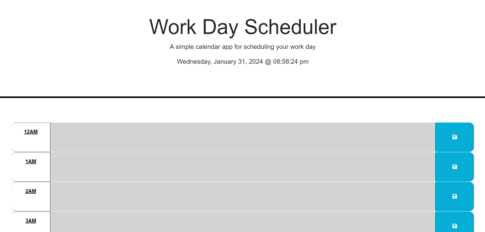
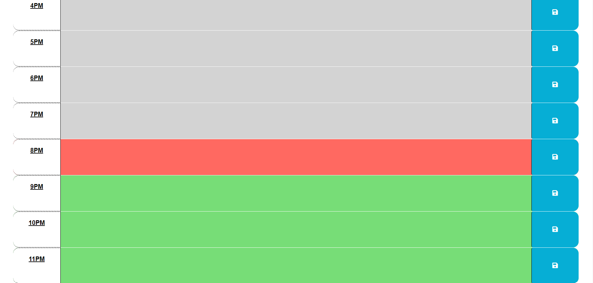

# Workday Planner 
This repository contains code for a very simple calendar app that allows users to create and save events for the current day. Originally, the idea was to use a typical 9AM-5PM workday layout, but with all of the different work times, I included the entire day so the user can lay out their day no matter when they work. The styling of the calendar shows the user when the event has or is going to take place. The time blocks are styled to show past events (grey color), present time events (red color), and future events (green color). 

# Screenshots

# Link to Deployed App 
https://dfussell1.github.io/workday-planner/

# Credit 
The starter code for this repository can be found here: https://github.com/coding-boot-camp/crispy-octo-meme